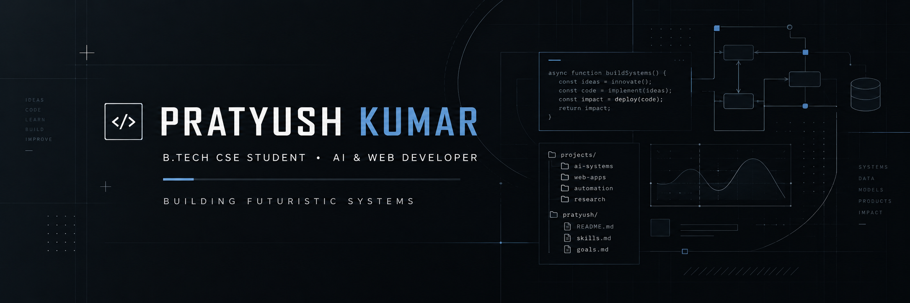

<div align="center">



</div>

---

### &nbsp; About Me

```yaml
profile:
  name: Pratyush Kumar
  handle: VirexEngine
  academics: B.Tech in Computer Science & Engineering
  focus_areas:
    - Artificial Intelligence & Machine Learning
    - Deep Learning, NLP & Data Science
    - Data Structures & Algorithms
    - Web Development & Intelligent Systems
  core_philosophy: "Architect clean foundations, turn ideas into practical products."
```

I'm a Computer Science undergraduate interested in AI, machine learning, and web development. I enjoy turning ideas into practical systems—from intelligent software and automation pipelines to sensor-driven applications and real-world engineering projects.

---

### &nbsp; Focus Areas

<table>
  <tr>
    <td width="33%" valign="top">
      <h4 align="center">🧠 AI & Intelligent Systems</h4>
      <p align="center">
        <sub>LLM integration, automated agent workflows, predictive pipelines, and structured inference with Gemini & Groq.</sub>
      </p>
    </td>
    <td width="33%" valign="top">
      <h4 align="center">⚙️ Full-Stack Engineering</h4>
      <p align="center">
        <sub>High-throughput REST APIs, component-driven client applications, state synchronization, and scalable data layers.</sub>
      </p>
    </td>
    <td width="33%" valign="top">
      <h4 align="center">🛠️ Automation & IoT</h4>
      <p align="center">
        <sub>Workflow orchestration with n8n, hardware telemetry integration, sensor telemetry, and containerized deployments.</sub>
      </p>
    </td>
  </tr>
</table>

---

### &nbsp; Technical Interests & Technologies

<p align="left"><b>Languages</b></p>
<p align="left">
  
  
  
  
</p>

<p align="left"><b>AI & Machine Learning</b></p>
<p align="left">
  
  
  
  
  
  
  
</p>

<p align="left"><b>Computer Science Foundations</b></p>
<p align="left">
  
  
  
  
</p>

<p align="left"><b>Web Development</b></p>
<p align="left">
  
  
  
  
  
  
</p>

<p align="left"><b>Databases</b></p>
<p align="left">
  
  
</p>

<p align="left"><b>Tools & Infrastructure</b></p>
<p align="left">
  
  
  
  
</p>

---

### &nbsp; Featured Projects

<table>
  <tr>
    <td width="50%" valign="top">
      <h3 align="left">Campus Companion</h3>
      <p align="left">
        <b>AI-Powered Smart Campus & College Management Ecosystem</b>
      </p>
      <p align="left">
        A unified platform streamlining academic operations, schedule tracking, and student services via responsive web interfaces and intelligent conversational assistants.
      </p>
      <p align="left">
        <b>Stack:</b> <code>React</code> <code>Node.js</code> <code>FastAPI</code> <code>MongoDB</code> <code>Gemini API</code>
      </p>
      <p align="left">
        <a href="https://github.com/VirexEngine/[PROJECT_URL]"><b>Source Code →</b></a>
        &nbsp;|&nbsp;
        <a href="https://[PROJECT_URL]"><b>Live Demo →</b></a>
      </p>
    </td>
    <td width="50%" valign="top">
      <h3 align="left">SENTINEL</h3>
      <p align="left">
        <b>Intelligent Solar-Powered Cold Storage & Anomaly Diagnostics</b>
      </p>
      <p align="left">
        Produce- and energy-aware micro-climate storage system integrating environmental telemetry, automated temperature/humidity loops, predictive spoilage alerts, and energy regulation.
      </p>
      <p align="left">
        <b>Stack:</b> <code>Python</code> <code>FastAPI</code> <code>Groq / Gemini</code> <code>IoT Sensors</code> <code>Docker</code>
      </p>
      <p align="left">
        <a href="https://github.com/VirexEngine/[PROJECT_URL]"><b>Source Code →</b></a>
        &nbsp;|&nbsp;
        <a href="https://[PROJECT_URL]"><b>Architecture Brief →</b></a>
      </p>
    </td>
  </tr>
</table>

---

### &nbsp; Engineering Activity

<div align="center">
  <picture>
    <source media="(prefers-color-scheme: dark)" srcset="https://github-readme-stats.vercel.app/api?username=VirexEngine&show_icons=true&theme=tokyonight&hide_border=true&bg_color=0d1117&title_color=00e599&icon_color=00e599&text_color=c9d1d9">
    <source media="(prefers-color-scheme: light)" srcset="https://github-readme-stats.vercel.app/api?username=VirexEngine&show_icons=true&theme=default&hide_border=true&bg_color=f6f8fa&title_color=0969da&icon_color=0969da&text_color=24292f">
    
  </picture>
  &nbsp;
  <picture>
    <source media="(prefers-color-scheme: dark)" srcset="https://github-readme-stats.vercel.app/api/top-langs/?username=VirexEngine&layout=compact&theme=tokyonight&hide_border=true&bg_color=0d1117&title_color=00e599&text_color=c9d1d9">
    <source media="(prefers-color-scheme: light)" srcset="https://github-readme-stats.vercel.app/api/top-langs/?username=VirexEngine&layout=compact&theme=default&hide_border=true&bg_color=f6f8fa&title_color=0969da&text_color=24292f">
    
  </picture>
</div>

---

### &nbsp; Connect

<div align="center">

Have an opportunity, an idea to explore, or want to talk engineering?

<br/>

<a href="https://linkedin.com/in/[LINKEDIN_URL]">
  
</a>
&nbsp;&nbsp;
<a href="https://[PORTFOLIO_URL]">
  
</a>
&nbsp;&nbsp;
<a href="https://github.com/VirexEngine">
  
</a>
&nbsp;&nbsp;
<a href="mailto:[EMAIL]">
  
</a>

</div>

---

<div align="center">
  <sub>Engineered with precision • Focused on impact • Always compiling</sub>
</div>
